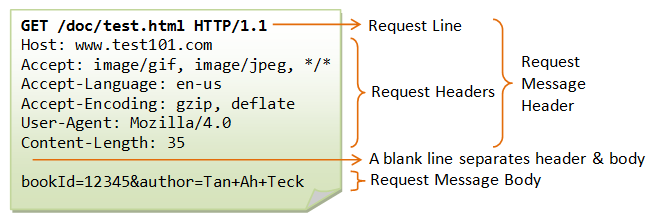

#! https://zhuanlan.zhihu.com/p/146172945
# 【计算机网络】
---
## 电路交换和分组交换
### 1. 电路交换 (Circuit switching)
- 两个用户建立专用链路，通信时占用链路
- 一旦接通，不需要地址
### 2. 分组交换 (Packet switching)
- 通信数据分为n个IP包（分组），每个IP包有地址信息（源地址，目的地址）
- 分组通过最佳路径（路由算法）路由到目标，一个分组流的分组不必以相同方式路由过物理网络，目的计算机把报文重新顺序排列恢复信息
- 同一线路同时传输多个分组
## 时延
总时延 = 排队时延 + 处理时延 + 传输时延 + 传播时延

---
## 网络体系结构
### 1. 五层协议
- **应用层：**
    - 为应用程序提供传输服务
    - HTTP（超文本传输协议）、DNS（域名解析协议）、FTP（文件传送协议）
    - 数据单位为报文
- **传输层：**
    - 为进程提供数据传输服务（到相应端口）
    - <u>TCP</u>（传输控制协议）：
        - <u>完整性</u>，可靠、连接的数据传输
        - 数据单位为报文段
    - <u>UDP</u>（用户数据报协议）：
        - <u>即时性</u>，无连接、不可靠数据传输
            - 无连接：通讯不需要建立断开连接
            - 不可靠：不会备份数据，不关心能否收到
        - 高效：头部只有8Bytes
        - 传输方式：支持单播，多播，广播
        - 数据单位为用户数据报
    - 重要设备：网关
- **网络层：**
    - 为主机提供数据传输（到目的节点）
    - 报文段/用户数据段封装为分组
    - 路径选择，路由和寻址
    - 协议：IP协议
        -  不可靠、无连接传输服务
    - 重要设备：路由器
- **数据链路层：**
    - 相邻主机之间数据传输
    - 分组封装为帧
    - 主要协议：以太网协议
    - 重要设备：网桥，交换机
- **物理层：**
    - 传输媒体上传输数据比特流
### 2. OSI
- 应用层 --> 应用层 + 表示层 + 会话层
- 共7层
### 3. TCP/IP
- 数据链路层 + 物理层 --> 网络接口层
- 不严格遵循OSI，应用层可能直接使用IP层/网络接口层
### 4. 层间传输
- 向下，添加下层协议需要的首部、尾部
- 向上，拆开首部、尾部
- 路由器不需要为进程、应用程序提供服务：只有下三层协议
---
## TCP/IP协议
- 由网络层IP协议，传输层TCP协议组成
### 1. IP
- 给每台设备规定一个地址
- 接收由网络接口层的数据包，转发到传输层TCP/UDP
- IP数据包由源地址，目的地址，数据包不可靠
### 2.TCP协议
- 面向连接的，可靠的
- 仅有双方彼此通信，不能用于广播
- TCP 使用校验和，确认和重传机制来保证可靠传输
- 头部字段：
    - Sequence number：报文顺序
    - Acknowledge number：下一个字节编号
    - Window Size：窗口大小，表示还能接收多少字节的数据，用于流量控制
    - 标识符：
        - ACK = 1:该字段为一表示确认号字段有效。此外，TCP 还规定在连接建立后传送的所有报文段都必须把 ACK 置为一。
        - SYN = 1：当SYN=1，ACK=0时，表示当前报文段是一个连接请求报文。当SYN=1，ACK=1时，表示当前报文段是一个同意建立连接的应答报文。
        - FIN = 1：此报文段是一个释放连接的请求报文。
#### 三次握手与四次挥手：

[参考：三次握手与四次挥手](https://hit-alibaba.github.io/interview/basic/network/TCP.html)
- 三次握手：
    - 建立TCP连接，客户端和服务器共发送三个包
- 四次挥手：
    - TCP连接拆除需要发送四个包
#### 滑动窗口
- 在 TCP 中，两端都维护着窗口：分别为发送端窗口和接收端窗口。
- 滑动窗口实现了流量控制。接收方通过报文告知发送方还可以发送多少数据，从而保证接收方能够来得及接收数据。

发送端窗口是由接收窗口剩余大小决定的。接收方会把当前接收窗口的剩余大小写入应答报文，发送端收到应答后根据该值和当前网络拥塞情况设置发送窗口的大小，所以发送窗口的大小是不断变化的。

当发送端接收到应答报文后，会随之将窗口进行滑动:

---
## HTTP协议
- HTTP 协议构建于 TCP/IP 协议之上，是一个应用层协议，默认端口号是 80
- HTTP 是**无连接无状态**的
### 1. URI
URI（统一资源标识符） = URL（统一资源定位符） + URN（统一资源名称）
### 2. 请求和响应报文：
- 请求报文

- 响应报文

### 3. HTTP方法
**请求报文**第一行为请求行，包含方法字段
#### GET
#### HEAD
#### POST
#### PUT
#### PATCH
#### DELETE
#### OPTIONS
#### CONNECT
#### TRACE

### 4. HTTP状态码
**响应报文**第一行为状态行，包含状态码+原因短语
|状态码	| 类别	| 含义| 
| ---- | ----- | ----|
|1XX |Informational(信息性状态码)|	接收的请求正在处理|
|2XX|Success(成功状态码)	|请求正常处理完毕|
|3XX|Redirection(重定向状态码)|	需要进行附加操作以完成请求|
|4XX|Client Error(客户端错误状态码)|服务器无法处理请求|
|5XX|Server Error(服务器错误状态码)|服务器处理请求出错|
- 常见：

|状态码|意义|
|------|-------|
| 200 OK | 请求正常处理完毕|
|204 No Content|请求成功处理，没有实体的主体返回|
|206 Partial Content|GET范围请求已成功处理
|301 Moved Permanently|永久重定向，资源已永久分配新URI
|302 Found|临时重定向，资源已临时分配新URI
|303 See Other|临时重定向，期望使用GET定向获取
|304 Not Modified|发送的附带条件请求未满足
|307 Temporary Redirect|临时重定向，POST不会变成GET
|400 Bad Request|请求报文语法错误或参数错误
|401 Unauthorized|需要通过HTTP认证，或认证失败
|403 Forbidden|请求资源被拒绝
|404 Not Found|无法找到请求资源（服务器无理由拒绝）
|500 Internal Server Error|服务器故障或Web应用故障
|503 Service Unavailable|服务器超负载或停机维护

### 5. HTTP首部？
有 4 种类型的首部字段：通用首部字段、请求首部字段、响应首部字段和实体首部字段。
### 6. HTTPS
通过TLS协议进行加密，通过HTTP传输
#### TLS
//TODO

---
## DNS
- 通过域名查询IP
- DNS在TCP握手前进行查询，由操作系统处理
- 基于UDP查询

---

## 输入URL到页面加载完成
1. DNS查询IP
2. 应用层下发数据到传输层，TCP握手，指明端口号
3. 传输层下发给网络层，IP协议确定IP地址，指示数据传输如何跳转路由器
4. 网络层下发数据链路层，封装到数据帧
5. 物理层传输
6. 服务器响应HTML文件
7. 浏览器判断状态码，200则解析，渲染

